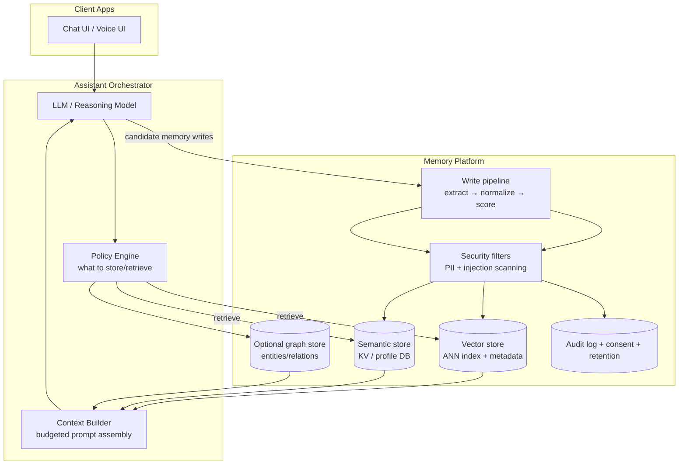
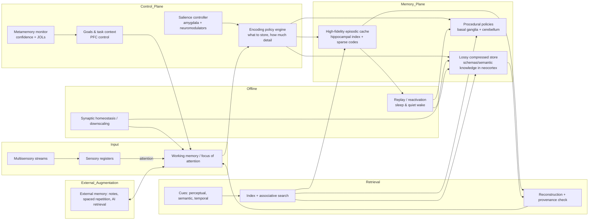

We are working with packages/llm, packages/llm-ui, packages/llm-memory and packages/thread only.


I need the behavior of how everything will be. We will only be using llm in this project for making planification and knowing what's needed, no regex uses, though we can make use of small llm, nlp, or big llms, depends on what's available. Any old regex should be removed.

I need to know behavior on when we first started till when we finished.


- How should prompt processing be behaved
- How should orchestrator be behaved
- How should finishing touch be behaved and putting things together.


Please help me build the perfect architecture and ask many questions to help us get there. I'd like a better runtime than anything that's out there that perfectly uses NLP, LLM, and memory system in harmony, with unlimited context size using smart maneuver to get us there. With unlimited amount of agents being able to run, based on how we set our system capability to be.


## Prompt processing

We know we might sometimes need a planning thought on which steps will be ran to get the best result from prompt processing llm, and how many agents will run, what memory is needed from text, and a fast llm that grab context, and history based on prompt, and grab events memory from what recently had happened. We do need a small llm to filter out tools, and pamphlets, mcp etc.

We know that if we need to plan thought we must also plan what agents will be ran, import necessary tools, and agents.

## Planning

We know we need agents to work in harmony together running multiple agents to get job done fast and right. And based on the prompt we determine what quality of output we expect.

And we should look into these as guidance on how the behavior should be:


- **Design blueprint for a bio‑inspired AI agent framework**
- **Recommendations for building a robust LLM agent**


## Memory

For memory will be having session memory, and cross session memory, which will need to evaluate in real time. But we should support offline memory that evaluate things when its not ensuring, evaluating where it can benefits us the most, our favorite things, setting up knowledge preference, evaluating what to keep or remove etc. Acting as our second brain and a mind map.

And for that we can look into:

- **Roadmap: building an optimal assistant memory system**
- **Proposal for an optimal human memory architecture with practical recommendations**


## Finishing blow

Where we put all agents responses together, and evaluate through memory our preference, and how we like our response to be. This won't always run this will only run when necessary. When we need specialize ai to output in a specific manner. When a single prompt can't determine how to style our response.

This can also run when we've used multiple lot's and lots of agents splitting the work, and we need to put things together without loosing any quality. For example working with database and we split the work.


## Goals for this project

This project goals make ai do human work, give ai ability to work with multi-step to think as it should, to be creative and most of all to be able to feed in loads of work and prompt and get it all done in a single shot.

My goal is to remove all ai weakness, and make a mini agi assistant that can replace human.


## Pamphlet Here's how I'd want it to be

I'd like a better design than what I present but the idea is, we have a simplified version than what we currently have. With steps being small prompts of what to run, and instruction letting us know how we run the steps. steps basically contain steps that may run in the process, and since it has prompt, I'm wondering if the steps can comes with tools as well, or tools is outside steps in the object. Thinking outside may actually be better but unsure.

Pamphlet can still contain other pamphlet just like we had before.

The new architecture would be something like this

{
	instruction : string;
	steps: Array<[{speed, reliable, contextSize, etc}]> 
	// can be nested array but will be flatted on setup, and needs documented, that nested array doesn't help in any cause, just helps when developing. Steps may have nested array but when reading, seen as singleton and flatline. So when defining similar step with different llm feedback, its useful in the prompt to determine when to use which.
}

when we run defineSkill or defineFlow the steps are flatten.


How will planning diagram be executed, and how will we manage agents, knowing what agent to run, where speed or quality is needed. Pamphlet will need to determine speed or quality with levels.

How do we make pamphlet 3d diagram to 1d, maybe we have instruction, and a step section. llm run through the steps as if they were prompt tools, but instruction is basically a prompt.


Question how do we make steering optional feature?? Helping guide and making sure we are untrack where common pitfalls happen??
{
	instruction : string;
	steps: Array<[{speed, reliable, contextSize, etc}]> 
	// can be nested array but will be flatted on setup, and needs documented, that nested array doesn't help in any cause, just helps when developing. Steps may have nested array but when reading, seen as singleton and flatline. So when defining similar step with different llm feedback, its useful in the prompt to determine when to use which.
	schema:
}


## Design blueprint for a bio‑inspired AI agent framework

Below is a concrete blueprint for building the kind of “harmony with peers” system you’re describing—one that can *explicitly* choose between getting work done **fast**, **efficiently**, or **correctly**, drawing directly from biological coordination plus best practices from modern agent tooling.

**Define three operating modes as policies, not personalities.** In biology, the same organism can behave differently depending on thresholds and context; you can implement the same idea by making “Fast / Efficient / Right” **first-class policies** that govern budgets and stopping rules. The drift diffusion result is a useful mental model here: if you change the decision boundary, you change the speed–accuracy profile without changing the underlying evidence accumulation mechanism. citeturn25view2 In agent terms, the policy should adjust: how many alternatives to explore (Tree-of-Thoughts depth), how many independent agents to consult, and how much verification is required before commit. citeturn6search3turn19view0

**Use a stigmergic “shared workspace” as the colony substrate.** Implement a shared artifact store (task board + evidence + intermediate outputs) that agents can both read and write. Stigmergy’s key function is externalized memory and coordination through traces. citeturn5search0turn11search14 In AI systems, this can look like:
- a durable event log of “claims, evidence, decisions,”
- a task graph with dependencies,
- ephemeral “pheromones” (time-decaying tags like `high_urgency`, `low_confidence`, `duplicate_detected`) that influence routing.

This is also how current best-in-class orchestrators operate implicitly: Anthropic emphasizes observability, tracing, and durable execution checkpoints because agents are stateful and errors compound. citeturn8view2turn8view0

**Implement expertise routing as transactive memory plus response thresholds.** You want “knowing which peer is best suited for what work.” Humans do this with transactive memory: a directory of who knows what plus communication patterns that retrieve the right knowledge efficiently. citeturn26view0 Implement an analog as:
- a capability graph: `{agent → skills → observed performance metrics → tool permissions}`,
- a task-to-skill mapping learned from outcomes.

Then add an ant-style *activation model*: each agent has thresholds for classes of tasks (bugs, architecture, research, security review). Response-threshold models show how different thresholds plus reinforcement can yield emergent specialization. citeturn5search2turn5search6 Concretely, when the “stimulus” for a task (e.g., “compile failing” or “citation needed”) rises above an agent’s threshold, it becomes likely to pick up that job; after successful completion, decrease threshold (making it more likely next time), otherwise increase it.

**Make leadership dynamic and lightweight: always have a lead, but don’t make it omniscient.** Many natural systems rely on local interactions, yet still exhibit effective “leadership.” Couzin et al. suggest a small fraction of informed individuals can guide the group; the mechanism doesn’t require explicit leader recognition. citeturn25view0 In agent frameworks, a practical analog is an orchestrator-worker pattern where the lead agent is mostly a **router and integrator**, not the main worker. Anthropic’s production Research system explicitly uses this approach. citeturn8view0turn7view2 OpenAI’s Agents SDK formalizes analogous delegation via handoffs, where the model chooses specialized agents/tools to call. citeturn20view2turn25view3

Leader selection can be automatic: choose the agent with the best historical performance on the task class, or choose a generalist “triage” agent whose primary job is decomposition and routing (similar to Swarm’s triage examples and OpenAI orchestration patterns). citeturn23view0turn20view3

**Use quorum-based commitment to switch from careful exploration to rapid execution.** Your strongest nature-derived rule is: **do not “go fast” until enough evidence has accumulated**. Ant emigration illustrates a crisp phase transition: slow “tandem runs” (careful recruiting) first, then fast “transport” once quorum is reached, improving commitment and speed while protecting against premature convergence. citeturn18view0 Honeybee models similarly emphasize that quorum thresholds are central to the speed–accuracy balance. citeturn19view0

In your AI framework, implement this with an explicit commit protocol:
- In **Right** mode: require a higher quorum (e.g., two independent solution attempts + one verifier + passing tests).
- In **Fast** mode: allow a lower quorum, but still require *minimum viable checks* (e.g., one run of a unit test or a factual source check).
- In **Efficient** mode: optimize for “expected value per token/minute,” stopping exploration once marginal gain falls below a threshold (the DDM “reward rate” framing is a helpful analogy). citeturn25view2

**Engineer correctness through tool design and constrained interfaces.** SWE-agent’s argument that ACI design materially impacts outcomes implies that “tools are policy.” citeturn6search2turn6search10 OpenCode’s Build vs Plan split is exactly this concept operationalized: the planning agent is restricted (asks before edits/commands), while Build has full tool access. citeturn20view0turn9view1 Anthropic similarly stresses tool selection heuristics and warns that poor tool descriptions can derail agents; they even describe using agents to rewrite tool descriptions after testing. citeturn8view2turn7view2

So your framework should treat every tool as having:
- a permission envelope (read/write/execute/network),
- a clear purpose and high-quality description,
- a safe “simulation” mode when in Right mode (dry-run diffs, non-destructive checks).

**Bake evaluation and observability into the coordination fabric.** Multi-agent systems generate emergent behaviors; Anthropic emphasizes that small changes can cascade unpredictably, and they describe using tracing plus an LLM judge rubric for evaluation. citeturn8view2turn8view3 On the research side, AgentBench and WebArena exist specifically to evaluate LLMs as agents in interactive environments. citeturn12search2turn12search3

To measure “fast vs right vs efficient,” your framework should output, for every run:
- a trace (decisions, handoffs, tool calls),
- per-step confidence/evidence,
- cost and latency,
- a post-hoc grade (unit tests pass/fail, rubric score, human approval).

This is aligned with OpenAI’s Agents SDK emphasis on keeping a full trace and supporting handoffs. citeturn25view3turn20view2

**Treat security as a core swarm property.** The recent security issues reported around open “skills” ecosystems reinforce a key lesson: agents with local execution privileges plus third‑party plugins create a large attack surface. citeturn2news48turn2news49 If your goal is to “outdo” competitors, a credible advantage is **secure-by-default agent orchestration**: signed skills, sandboxed execution, strict permissioning, and robust prompt-injection defenses, especially in any model-context/tool protocol integration (MCP-style). MCP is explicitly designed to connect AI assistants to external systems and tools, which makes security posture essential. citeturn12search1turn12search0turn8view2

A simple but powerful design rule from biological systems: **limit catastrophic actions**. Ants can’t delete their nest with one wrong move; your agents shouldn’t be able to either.

**Interoperability layer: build on existing “handoff/subagent” primitives, but make policy the differentiator.** OpenAI’s Agents SDK handoffs and Claude’s subagents both delegate based on descriptions and support specialization. citeturn20view2turn20view1 OpenCode’s agent configuration combines role prompts with tool permissions and explicit agent types (primary vs subagent). citeturn20view0turn9view1

To “outdo” them, the differentiator isn’t merely “more agents.” It’s a **principled adaptive control system** that:
- chooses agent count via explicit effort-scaling rules (Anthropic gives concrete heuristics for subagent counts by query complexity), citeturn8view2turn8view0
- chooses commitment/quorum thresholds per risk mode (bee/ant quorum logic), citeturn19view0turn18view0
- routes tasks via learned “who knows what” (transactive memory) and threshold reinforcement (division of labor), citeturn26view0turn5search2
- and proves performance with benchmarked, trace-based evaluation (AgentBench/WebArena + your own suites). citeturn12search2turn12search3turn8view3


## Recommendations for building a robust LLM agent

### A reference “best-practices” architecture

The following architecture combines the strongest observed practices from Codex’s harness model, OpenAI’s Agents SDK guardrails/tracing, LangGraph state management, and Gemini/Claude grounding patterns—while explicitly applying NCSC-style injection-resilient design.

```mermaid
flowchart TD
  U[User / Channel] --> GATE[Gateway\n(auth, rate limits, identity)]
  GATE --> ORCH[Deterministic Orchestrator\n(state machine / graph)]
  ORCH --> GUARDIN[Input Guardrails\npolicy + injection signals]
  GUARDIN --> PLAN[Planner Agent\nlow tool privileges]
  PLAN -->|plan + tool intents| POLICY[Tool Policy Engine\nleast privilege + budgets]
  POLICY --> EXEC[Executor Agent\nprivileged but constrained]
  EXEC --> SANDBOX[Sandbox Runtime\nFS/network caps + approvals]
  SANDBOX --> TOOLS[Tools\n(DB, RAG, web, shell, SaaS)]
  TOOLS --> SANDBOX --> EXEC --> ORCH
  ORCH --> MEM[State Store\nshort-term + long-term]
  ORCH --> TRACE[Tracing + Audit Logs\n(tool calls, diffs, evidence)]
  ORCH --> GUARDOUT[Output Guardrails\nPII + policy + formatting]
  GUARDOUT --> RESP[Final Response\n+ citations/evidence]
  RESP --> U
```

### Concrete implementation guidance

**Use a graph/state-machine orchestrator, not a single opaque loop.** LangGraph’s approach—explicit nodes, stop conditions, checkpointed state—maps to production realities (retries, timeouts, human review). citeturn2search1turn2search33turn12search14

**Split planning from execution, and gate tool use through policy.** Treat prompt injection as a residual risk: process untrusted content in low-privilege contexts and only elevate privileges after deterministic checks. This matches the NCSC’s “confusable deputy” framing and aligns with OpenClaw’s admonition that prompts are soft controls. citeturn15view0turn10search2turn4search2

**Make evidence a first-class output contract.** For coding agents, require diffs + tests/logs (Codex-style). For knowledge agents, require grounded citations (Gemini Search grounding style) or retrieved-doc identifiers (RAG). citeturn20search1turn20search0turn4search3

**Default to ask/approve for destructive or irreversible actions.** Both OpenCode and Codex explicitly rely on approvals for edits/commands as a primary safety mechanism. citeturn10search28turn20search0turn20search20

**Adopt deep tracing from day one.** OpenAI’s Agents SDK treats tracing as a core feature, capturing LLM generations, tool calls, guardrails, and handoffs. Replicate this standard even if you do not use OpenAI’s SDK. citeturn5search15turn5search11

**Engineer memory as a governed data product.** Implement: (a) short-term conversation state, (b) long-term user profile memory with explicit consent boundaries, and (c) retention modes and deletion tools matching regulatory needs. OpenAI and Google both expose explicit activity and retention controls; OpenAI also documents how certain async features affect retention guarantees. citeturn7search0turn8search2turn4search0turn7search15

**Treat skills/plugins/MCP servers like package dependencies.** Require signing, provenance, scanning, allowlists, and sandboxing—because real-world incidents show skill marketplaces become malware vectors quickly. citeturn10news55turn10search26turn9search3turn9news49

## Prioritized primary sources

This list is prioritized toward **official documentation, original papers, and first-party engineering posts** in English, because those sources most directly describe architectural intent and constraints.

OpenAI Codex and agents
* OpenAI, “Introducing Codex” (cloud SWE agent; parallel sandboxed tasks; codex-1 based on o3). citeturn20search1turn0search18  
* OpenAI, “Unlocking the Codex harness: how we built the App Server” + Codex App Server docs (bidirectional JSON-RPC; core threads + event protocol). citeturn5search7turn5search0  
* OpenAI Developer Docs, Codex Security (network off by default; OS sandbox; approvals). citeturn20search0  
* OpenAI, “Addendum to OpenAI o3 and o4-mini system card: Codex” (RL on real-world tasks; iterative tests). citeturn20search25  
* OpenAI Developer Docs, Agents SDK + Tools + Guardrails + Tracing. citeturn5search8turn4search8turn5search2turn5search15  
* OpenAI Developer Docs, Data controls (“API data not used to train unless opt-in”) + Enterprise privacy (retention defaults/controls). citeturn7search0turn7search15  
* OpenAI Developer Docs, Background mode (async behavior; ZDR incompatibility). citeturn4search0  
* Chen et al. (OpenAI), “Evaluating Large Language Models Trained on Code” (Codex; GitHub fine-tuning; HumanEval). citeturn14view2turn8search0

Anthropic Claude and agent ecosystems
* Anthropic, “System Card: Claude Opus 4 & Claude Sonnet 4” (hybrid reasoning; safety levels; agentic evals). citeturn14view1turn12search3  
* Anthropic, “Constitutional AI: Harmlessness from AI Feedback” (alignment method and motivation). citeturn11search3turn14view5turn11search7  
* Anthropic API Docs, tool use implementation + jailbreak/prompt injection mitigation. citeturn4search14turn4search2  
* Anthropic Engineering, “How we built our multi-agent research system” (orchestrator-worker pattern). citeturn5search23  
* Anthropic, “Introducing advanced tool use” (dynamic tool discovery/execution). citeturn5search30  
* Anthropic, “Introducing the Model Context Protocol (MCP)” (open standard for tool/data connectors). citeturn9search3

Google Gemini / Assistant
* Google Blog, “Bard is now known as Gemini” (product evolution). citeturn1search3  
* Gemini API Docs: Function calling; Grounding with Google Search. citeturn4search15turn4search3turn4search7  
* Google Help: Gemini Apps Activity / privacy hub (user controls for activity and training). citeturn8search2turn8search26  
* Google Developers: Conversational Actions sunset overview (platform deprecation). citeturn6search3  
* Gemini API Usage Policies: abuse monitoring data not used to train models. citeturn7search14

Amazon Alexa
* “Just ASK” architecture paper on Alexa Skills Kit extensibility. citeturn1search19  
* Amazon Science: scalable neural architecture for Alexa skill selection/arbitration. citeturn1search12  
* AVS Device SDK docs (“What is AVS?”) + Alexa developer documentation. citeturn6search20turn6search0  
* AP reporting on removal of “Do Not Send Voice Recordings” local-only feature (privacy/processing shift). citeturn21news47  
* Amazon acknowledgment of rare unintended recording/share incident (2018) and analyses. citeturn8search19turn8news53

Apple Siri
* Apple Newsroom: Siri privacy commitment; on-device processing where possible. citeturn1search1  
* Apple Developer Documentation: SiriKit / Intents / App Intents integration model. citeturn6search2turn6search14turn6search6  
* Ars Technica reporting on $95M Siri settlement (inadvertent activation/recording allegations). citeturn21search11

OpenCode and OpenClaw
* OpenCode Docs: server architecture (OpenAPI 3.1), SDK, tooling, permissions, LSP integration. citeturn10search12turn10search20turn10search21turn10search1turn9search0  
* OpenClaw Docs: Gateway architecture, heartbeat, security hardening model. citeturn9search18turn9search2turn10search2  
* Snyk “ToxicSkills” study and major reporting on OpenClaw skills malware incidents (illustrates real-world supply-chain risk). citeturn10search26turn10news55

Cross-cutting security and research foundations
* UK NCSC, “Prompt injection is not SQL injection (it may be worse)” (core threat model). citeturn15view0  
* OWASP Cheat Sheet Series: LLM Prompt Injection Prevention. citeturn11search2  
* ReAct paper (agent prompting foundation). citeturn11search0  
* Toolformer paper (self-supervised tool-use learning concept). citeturn11search1turn11search9


## Roadmap: building an optimal assistant memory system

This roadmap prioritizes **assistant-memory outcomes** (coherence, personalization, controllability, safety, cost) and aligns with what recent benchmarks and systems actually measure (LoCoMo, LongMemEval, Mem0). citeturn25view0turn26view0turn36search0

### Target architecture



This is essentially the “three-stage” long-term memory model (construct/manage/retrieve/use) described in modern memory surveys and reflected in systems like Mem0 and LangMem. citeturn33view0turn36search0turn9search8

### Prioritized implementation phases

**Phase: Establish the baseline and evaluation harness**  
Adopt LoCoMo and LongMemEval as your CI benchmarks, because they directly test interactive, multi-session assistant memory rather than generic long-context. citeturn25view0turn26view0  
Also add a long-context diagnostic suite (RULER + a needle test harness + LongBench) to understand when context-window scaling helps vs hurts. citeturn7search2turn7search3turn7search0

**Phase: Implement minimal viable memory tiers**  
1) **Working memory:** last N turns + current task state (structured).  
2) **Semantic memory:** explicit preference/fact/profile KV store (small, high-precision).  
3) **Episodic memory:** chunked conversation/event memories in vector store with metadata (time, source, importance, privacy).  

This matches the object/form/time taxonomy used in recent surveys. citeturn33view0turn34view0

**Phase: Build the write/consolidate path**  
Implement extraction (turn → candidate facts/preferences/events), dedupe, and update policies (merge, supersede, invalidate). MemoryBank’s emphasis on forgetting/reinforcement highlights the need for time- and importance-aware updates. citeturn36search3turn33view0  
Mem0’s paper is a practical reference for extraction + consolidation + retrieval design and benchmarking on LoCoMo. citeturn36search0turn16view0

**Phase: Retrieval and ranking**  
Retrieval should be **hybrid**:  
- semantic KV lookup for stable “profile facts” (fast, deterministic)  
- vector similarity over episodic memories (ANN)  
- optional graph traversal for relational queries (who/what/when links)

ANN indexing choices: HNSW is widely used; its original work describes hierarchical graph construction for efficient approximate kNN. citeturn30search0  
For implementation, production systems frequently rely on FAISS or vector DBs (Qdrant, Milvus, Weaviate, Chroma, pgvector). citeturn11search0turn11search5turn11search2turn13search8turn12search8turn13search9

**Phase: Security hardening and governance**  
Adopt OWASP LLM Top 10 controls and treat prompt injection as a residual risk to be contained, consistent with UK NCSC guidance. citeturn29search0turn29search2  
Specifically for memory/RAG: protect the ingest pipeline against poisoning, and separate “retrieved data” from “instructions” at the prompt-template level (e.g., tool outputs are quoted/escaped and treated as untrusted). Empirical work on backdoored retrievers and retrieval poisoning shows these are real attack vectors. citeturn28search0turn28search12turn28search1  
Offer explicit user controls (view/delete/disable), consistent with consumer memory norms. citeturn19search9turn19search1

### Comparative tables

#### Research approach comparison

| Approach family | Representative works | Memory type | Persistence | Retrieval / access | Scalability | Latency | Privacy posture | Integration maturity | Typical license |
|---|---|---|---|---|---|---|---|---|---|
| Differentiable external memory | Memory Networks; DNC; Sparse DNC | latent/slot memory | model/runtime-dependent | differentiable read/write | historically challenging; sparse variants improve | variable | hard to audit content; model-internal | low for LLM assistants | mixed; code varies citeturn3search16turn5search0turn5search8 |
| Recurrent transformer memory | Transformer-XL; Compressive Transformer; RMT | token/state memory | session/runtime | cached states / memory tokens | good; can reach extreme lengths | good | limited user control | medium | research code varies citeturn0search8turn2search10turn24view0 |
| Retrieval-augmented generation | REALM; RAG; RETRO; Atlas | external text memory | persistent | dense retrieval + conditioning | strong; scales with index | depends on ANN + rerank | can add provenance; needs safeguards | high in industry | OSS varies citeturn39view0turn38view0turn6search0turn22view0 |
| Agent memory managers | MemGPT/Letta; Mem0; LangMem; MemoryBank | episodic + semantic + policies | persistent | explicit store/search/consolidate | strong if designed well | optimized by retrieval | explicit controls possible | high and growing | mostly permissive OSS citeturn37view0turn21view0turn36search0turn15search1turn36search3 |

#### Open-source memory frameworks and infra

Stars and languages are snapshots from GitHub pages crawled around **2026-02-20**.

| Project | What it provides | Stars / language / license | Install/run notes (from repo/docs) |
|---|---|---|---|
| **Mem0** (`mem0ai/mem0`) | Universal memory layer for agents; extraction/consolidation; evaluation tooling; paper + LoCoMo results | 47.7k; Python/TS; Apache-2.0 citeturn16view0turn36search0 | `pip install mem0ai` (repo quickstart) and configure LLM; provides API/docs citeturn16view0turn9search5 |
| **Letta** (`letta-ai/letta`) | Stateful agent platform with persistent memory blocks and APIs (evolved from MemGPT) | 21.2k; Python; Apache-2.0 citeturn21view0 | CLI via `npm install -g @letta-ai/letta-code`; API SDKs via `pip install letta-client` etc. citeturn21view0turn9search6 |
| **LangMem** (`langchain-ai/langmem`) | Memory extraction + tools for LangGraph agents; semantic/episodic tooling | 1.3k; Python; MIT citeturn15search1turn36search9 | Integrates with LangGraph storage; provides “memory tools” for manage/search citeturn9search0turn9search8 |
| **LangChain** (`langchain-ai/langchain`) | Broad agent framework with multiple memory implementations (buffers, summarization, vectorstore token buffer) | 127k; Python; MIT citeturn14view0turn9search15 | `pip install langchain`; memory modules in core library citeturn14view0 |
| **LlamaIndex** (`run-llama/llama_index`) | Data + agent framework; explicit memory module and chat memory buffers | 47.1k; Python; MIT citeturn17view0turn10search1 | Docs describe `Memory` and `ChatMemoryBuffer` usage; supports persistence through stores citeturn10search1turn10search0 |
| **Haystack** (`deepset-ai/haystack`) | Orchestration framework stressing transparent retrieval/memory/tooling pipelines | 24.2k; Python; Apache-2.0 citeturn10search2 | `pip install haystack-ai`; tutorials include conversational RAG with chat stores citeturn10search6turn10search12 |
| **Kernel Memory** (`microsoft/kernel-memory`) | “Memory solution” research project for indexing + semantic search + RAG | 2.1k; C#; MIT citeturn15search3 | Provided as a research prototype; integrates into .NET ecosystems citeturn15search3 |
| **Semantic Kernel** (`microsoft/semantic-kernel`) | SDK for agents + embeddings-based memory plugin | 27.3k; multi-lang; MIT citeturn18view0turn10search7 | `pip install semantic-kernel` or .NET packages; supports “memory” plugins citeturn18view0turn10search3 |

#### Vector search engines and libraries used by memory systems

| Layer | Project | Stars / language / license | Notes |
|---|---|---|---|
| Vector similarity library | FAISS (`facebookresearch/faiss`) | 39.1k; C++/Python/CUDA; MIT citeturn11search0 | Foundational ANN/similarity tooling; tied to “billion-scale similarity search with GPUs” paper citeturn30search1turn30search9 |
| Vector DB | Milvus (`milvus-io/milvus`) | 42.8k; Go/C++; Apache-2.0 citeturn11search10 | Cloud-native vector DB; SDKs like `pymilvus` documented in repo citeturn11search2 |
| Vector DB | Qdrant (`qdrant/qdrant`) | 28.8k; Rust; Apache-2.0 citeturn11search1turn11search5 | Payload filtering + vector search; Rust implementation citeturn11search5 |
| Vector DB | Weaviate (`weaviate/weaviate`) | 15.6k; Go; BSD-3-Clause citeturn13search8 | Combines vector search with filtering and RAG support citeturn11search3turn13search8 |
| Vector DB | Chroma (`chroma-core/chroma`) | 26.2k; multi-lang; Apache-2.0 citeturn12search8turn13search6 | Popular embedded vector DB; easy prototyping + persistence citeturn12search0turn12search8 |
| Postgres extension | pgvector (`pgvector/pgvector`) | 19.9k; C; (Postgres license family) citeturn13search9turn12search1 | Brings vector similarity (incl. HNSW/IVF options) into Postgres citeturn12search5turn12search9 |
| ANN library | Annoy (`spotify/annoy`) | 14.2k; C++/Python; Apache-2.0 citeturn31view0 | Disk-mmap friendly ANN indexes; production use cases described in README citeturn31view0 |

### Integration patterns with LLM APIs

OpenAI’s developer platform offers stateful conversation primitives and vector-store primitives that can be used as part of a memory architecture:

- **Conversations API**: “store and retrieve conversation state across Response API calls.” citeturn19search3  
- **Vector stores**: described as powering semantic search for retrieval/file_search tools. citeturn19search6turn19search2  
- **Responses API**: supports “stateful interactions” and built-in tools (including file search). citeturn19search7  

Separately, consumer memory controls show how product assistants implement user agency and scope: OpenAI notes memory is optional, user-controlled, and intended for high-level preferences. citeturn19search9turn19search1  

### Cost and performance estimates

Because costs depend heavily on provider and hardware, the most useful planning tool is a **cost model** (formula + representative assumptions):

**Storage cost (vectors):**  
If you store **N** memories as embeddings of dimension **d** using float16, raw vector storage is ≈ `N * d * 2 bytes` (plus index overhead). ANN indexes like HNSW add additional graph/link overhead; the HNSW paper describes the hierarchical graph structure and its performance tradeoffs. citeturn30search0  

**Compute cost drivers:**  
- **Write path:** extraction + embedding + indexing.  
- **Read path:** ANN query + optional rerank + prompt assembly + LLM tokens.  
Mem0 motivates memory primarily as a way to reduce *full-history token costs* and latency, reporting large reductions vs full-context. citeturn36search0turn16view0  

**Latency budgeting:**  
A practical p95 target for “feels instant” chat is often low seconds. Memory systems should target retrieval in ~tens of milliseconds (in-process or nearby DB) and keep prompt sizes bounded; streaming/recurrent approaches reduce recomputation and KV cache costs in long sessions. citeturn32view0turn0search8  

### Gaps and promising research directions

Recent surveys argue the field is fragmented and call for clearer taxonomies, unified benchmarks, and trustworthiness work. citeturn34view0turn33view0 The most promising directions for “best assistant memory” include:

- **Unified evaluation across paradigms** (long-context vs RAG vs memory managers), hinted by new evaluation proposals. citeturn7search7  
- **Memory dynamics and automation** (when to write, how to consolidate, how to forget) as first-class primitives; MemoryBank’s forgetting-inspired updates and Mem0’s extraction/consolidation pipeline exemplify early approaches. citeturn36search3turn36search0turn33view0  
- **Security-aware memory**: research on retriever backdoors and retrieval poisoning suggests we need standardized defenses and audits for the memory ingest and retrieval path. citeturn28search0turn28search12turn29search0turn29search2  
- **Human-like episodic memory alignment:** cognitive reviews argue that memory-augmented LLMs could better align with human episodic memory properties (selective encoding, temporal contiguity, competition at retrieval), and propose benchmark criteria beyond QA. citeturn35view0turn34view0  


## Proposal for an optimal human memory architecture with practical recommendations

An “ideal” human memory system depends on what we optimize: academic performance, decision quality, emotional well-being, creativity, or truth-tracking. The most defensible general-purpose target (for modern environments) is:

> **High decision utility per unit energy and attention**, with **controllable salience** and **auditable accuracy**.

### Design goals and trade-offs

A biologically plausible optimal architecture would keep the brain’s existing portfolio (sensory/WM/episodic/semantic/procedural) but add *control-plane improvements*:

1. **Better indexing and search**: more reliable cue → memory mapping, including temporal ordering and source context (reducing “tip of the tongue” and misattribution). This extends hippocampal indexing ideas and autobiographical organization models. citeturn0search5turn4search3  
2. **Explicit provenance + confidence tags**: store not just content but *where it came from* (perception vs inference vs testimony), reducing misinformation-driven errors highlighted in classic false-memory research. citeturn6search1turn14search0  
3. **Hybrid compression policies (lossy by default, lossless on demand)**: semantic gist is the default store, but the system keeps a bounded high-fidelity “episodic cache” for high-value episodes, aligned with complementary learning systems (fast episodic buffer) and schema-based integration. citeturn5search0turn7search2  
4. **Selective forgetting as an active service**: intentional “garbage collection” that reduces access to irrelevant or harmful memories while preserving learned knowledge and skills, borrowing from evidence on suppression/control and sleep homeostasis. citeturn5search11turn1search11  
5. **Emotional tagging control**: keep amygdala-based prioritization for emergencies, but add stronger top-down regulation “dials” to prevent overconsolidation of trauma-like material while still learning from it. citeturn2search3turn6search7  
6. **State-aware consolidation**: schedule heavy consolidation in sleep/offline windows and use replay-like mechanisms to integrate memories without saturating synapses (synaptic homeostasis + replay). citeturn1search2turn19search1turn1search7  

### Proposed architecture diagram



This architecture is essentially a **controlled hybrid of hippocampal fast learning and neocortical slow learning**, consistent with CLS theory, plus a stronger metacognitive control loop (Nelson–Narens) and explicit sleep/homeostasis modules. citeturn5search0turn4search2turn1search2turn1search11

### Implementation pathways

**Near-term (behavioral + tool-based):**  
- Treat working memory limits as a design constraint; offload “state” into external tools and focus on consolidation-friendly routines rather than brute-force rereading. The strongest evidence-based techniques are retrieval practice and distributed practice. citeturn16search1turn16search12turn16search2  
- Use mnemonic strategies strategically (method of loci) for high-volume arbitrary material; evidence suggests these methods recruit hippocampal spatial systems and can change functional connectivity with training. citeturn14search1turn9search3  
- Protect sleep as a consolidation window; sleep-dependent consolidation frameworks and replay evidence imply that chronic sleep restriction is not just “lost time” but a direct hit to memory reorganization. citeturn1search2turn19search0  
- Add aerobic exercise to support hippocampal health and spatial memory; randomized evidence in older adults shows increased hippocampal volume and improved spatial memory with aerobic training. citeturn16search3turn16search15  

**Mid-term (clinical-grade augmentation):**  
- Personalized neuromodulation that targets networks (not just regions), using state detection (closed-loop) rather than open-loop stimulation, following results that show improved memory when stimulation rescues poor encoding states. citeturn9search0turn9search8  
- Continue development of neuroprosthetic models for restricted clinical populations (epilepsy monitoring, TBI, neurodegenerative disease), with careful evaluation given mixed stimulation outcomes in MTL. citeturn11search4turn9search2turn9search1  

### Practical recommendations to improve human memory now

These recommendations map directly to the mechanisms above (encoding quality, retrieval strength, consolidation, and selective forgetting) and prioritize high-evidence, low-risk interventions.

Improve encoding and retrieval strength  
- Use **practice testing**: convert notes into questions and regularly attempt retrieval; this reliably improves long-term retention over restudy. citeturn16search1turn16search2  
- Use **spacing**: distribute study/review across days/weeks; large-scale meta-analysis supports robust spacing benefits. citeturn16search12turn16search0  
- Use **interleaving and elaboration** when learning concepts; major reviews rank elaborative interrogation/self-explanation/interleaving as moderate-to-high utility depending on domain and implementation. citeturn16search2turn16search14  
- For large arbitrary lists, use **method of loci**; evidence from memory athletes and training studies supports substantial gains through strategy rather than innate “photographic” storage. citeturn14search1turn9search7  

Protect consolidation and manage “memory budget”  
- Prioritize **sleep regularity and sufficient duration**; sleep supports consolidation via coordinated oscillations and replay-like mechanisms. citeturn1search2turn10search2turn19search0  
- Consider **targeted review before sleep** for material you want consolidated; this aligns with sleep-dependent consolidation frameworks (without requiring any invasive manipulation). citeturn1search2turn10search5  

Reduce distortion and improve truth-tracking  
- Keep **provenance notes** (“observed vs inferred vs told by X”), because memory is reconstructive and vulnerable to suggestion/misinformation. citeturn6search1turn6search0  
- Rehearse **source monitoring** during recall (“How do I know this?”). HSAM work shows that even extraordinary autobiographical recall does not immunize against false memory. citeturn14search0turn13search0  

Use selective forgetting safely  
- For intrusive/unwanted thoughts, evidence supports that deliberate control processes can reduce retrieval, but effects vary; clinically, structured therapies are safer than DIY suppression for trauma-related memories. citeturn5search11turn12search6  
- Avoid “over-rehearsal” of distressing material right before sleep when possible, given sleep’s role in consolidation; instead, use downregulation strategies and professional support when needed. citeturn1search2turn2search3  

External augmentation as part of the “ideal system”  
- Treat calendars, reminders, and spaced-repetition systems as an **extended prospective memory module** and a **semantic rehearsal scheduler**. This is aligned with the reality that prospective memory is fragile and BA10-dependent, and that spacing/testing are high-utility learning techniques. citeturn3search2turn16search2turn16search0  

In short, the best-supported “ideal memory” is not a literal perfect recorder. It is a **well-indexed, strategically compressed, emotionally regulated, audit-friendly system** that learns quickly when needed, generalizes wisely, and forgets deliberately—using sleep and control processes to keep the whole system stable and efficient. citeturn5search0turn7search2turn1search11turn6search0